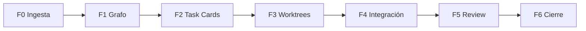

# Workflow de Orquestación — F0 a F6

## Diagrama general



---

## F0 — Ingesta y contexto

**Actor:** Orquestador (Grok 4.5)

**Entrada:** Pedido de alto nivel del usuario.

**Acciones:**
1. Reformular objetivo medible
2. Leer Architecture Memory + archivos clave del repo
3. Identificar riesgos (mapa, shell, permisos, CLS)
4. Clasificar: trivial | serial | paralelo-híbrido

**Salida:** Brief de 5–10 líneas + lista de áreas tocadas.

---

## F1 — Descomposición + Dependency Graph

**Acciones:**
1. Partir en subtareas `T0…Tn`
2. Declarar dependencias explícitas
3. Agrupar en Waves (máx. 2–3 escritores en Wave 1)
4. Asignar especialista a cada nodo

**Salida:** Mermaid + tabla Wave/Especialista/Archivos.

---

## F2 — Asignación + Prompts Composer

**Acciones:**
1. Emitir Task Cards completas
2. Generar prompts listos para pegar (incluyen system specialist + tarea)
3. Definir criterios de aceptación por tarjeta y globales

**Salida:** Bloques copy-paste para Cursor Composer.

---

## F3 — Ejecución paralela (worktrees)

**Actor:** Usuario + Composer

**Instrucciones típicas (el usuario ejecuta):**

```bash
# Desde main limpia
git fetch
git checkout -b integration/skeleton-menu

# Worktree agente A
git worktree add ../wt-loading-shell -b feat/skeleton-shell

# Worktree agente B
git worktree add ../wt-loading-map -b feat/skeleton-map

# Worktree agente C (si Wave 0 ya mergeó)
git worktree add ../wt-loading-views -b feat/skeleton-views
```

**Reglas:**
- Un Composer chat por worktree
- Pegar solo el prompt de su Task Card
- No empujar a main directamente
- Señal de done: typecheck local + resumen de archivos

**Salida:** Branches listas para merge.

---

## F4 — Integración y conflictos

**Actor:** Orquestador guía; usuario mergea (o un Composer “integrator”)

**Orden típico:**
1. Merge Wave 0 (contratos/primitivas) → branch integration
2. Merge Wave 1 en orden de menor conflicto (alfabético de paths o el plan)
3. Resolver solo archivos de frontera
4. Ajustes mínimos de import paths

**Salida:** Branch `integration/...` unificada.

---

## F5 — Review arquitectónica

**Actor:** Review & Quality Agent

**Acciones:** Veredicto APPROVE / NITS / BLOCK  
**Si BLOCK:** nuevas Task Cards quirúrgicas (no reabrir scope).

---

## F6 — Cierre y memoria

**Acciones:**
1. Resumen ejecutivo
2. Checklist de prueba manual (rutas del menú)
3. Patch propuesto a `PROJECT_ARCHITECTURE_MEMORY.md`
4. Próximos pasos opcionales

---

## RACI resumido

| Fase | Orquestador | Composer | Usuario | Review |
|------|-------------|----------|---------|--------|
| F0–F2 | R | — | C | — |
| F3 | C | R | A (lanza) | — |
| F4 | C | C | A/R | — |
| F5 | C | — | C | R |
| F6 | R | — | I | C |

R=Responsible, A=Accountable, C=Consulted, I=Informed
