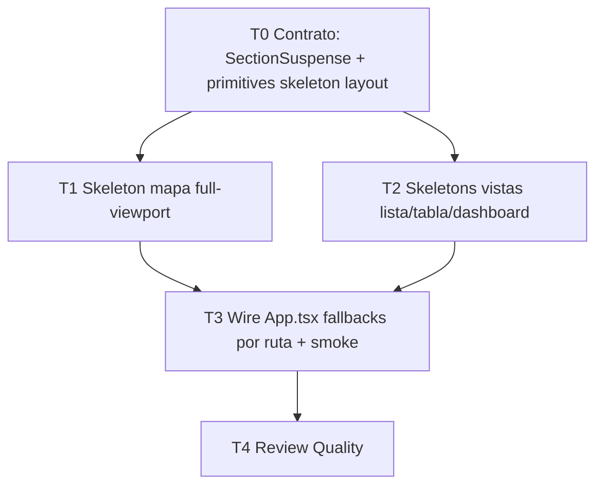

# Ejemplo completo de orquestación

## Tarea de entrada (usuario)

> Implementar skeleton loading states profesionales para todas las secciones del menú lateral del dashboard, incluyendo el mapa, manteniendo coherencia con el diseño actual.

---

## F0 — Ingesta y contexto

**Objetivo medible:** Al navegar cualquier ítem activo del `AppSidebar`, el usuario ve un **skeleton de sección** (no `PantallaCarga` full-brand) que reserva el layout final hasta que el chunk lazy y/o los datos iniciales estén listos; el **mapa** tiene un placeholder de viewport completo dentro del inset.

**Contexto real del repo:**
- Rutas lazy + `Suspense` en `App.tsx` con fallback `PantallaCarga`
- Shell: `AppShell` → sidebar + topbar + `Outlet`
- Ya existen `Skeleton` y `SidebarMenuSkeleton`
- Mapa: `CentrosView` / `CentrosMap` + `MapaCentrosContext` (montaje caro)
- Menú varía por rol (`domain/permisos.ts`)

**Riesgos:**
- CLS al reemplazar `PantallaCarga` por skeletons distintos por ruta
- Re-montar mapa si el skeleton vive mal acoplado
- Duplicar N skeletons casi iguales sin primitiva compartida
- Tocár `App.tsx` desde varios agentes → conflicto

**Clasificación:** Híbrida — Wave 0 contrato compartido, Wave 1 paralelo (mapa ∥ vistas lista/dashboard), Wave 2 wiring Suspense + review.

**Asunción documentada:** “Todas las secciones del menú” = rutas **implementadas** (no items `EnDesarrollo`). Skeletons cubren **lazy chunk + loading de datos inicial** donde el hook ya expone `loading`.

---

## F1 — Dependency Graph



| ID | Wave | Especialista | Paralelo |
|----|------|--------------|----------|
| T0 | 0 | `ui-architect` + toque `styling` | Solo |
| T1 | 1 | `map-geo` + `loading-perf` | ∥ con T2 |
| T2 | 1 | `loading-perf` | ∥ con T1 |
| T3 | 2 | `loading-perf` (integrator) | Solo |
| T4 | 2 | `review` | Solo |

**Archivos disjuntos Wave 1:**
- T1: `src/features/centros/*Map*`, `*CentrosView*`, nuevo `MapaSkeleton.tsx`
- T2: skeletons en `dashboard`, `incidencias`, `censo`, `refugiados`, `usuarios`, `logs`, `config`, `tablero` — **sin** `App.tsx`
- T3: dueño exclusivo de `App.tsx` (+ imports)

---

## F2 — Task Cards + Prompts

### Task Card: T0 — Contrato de loading de sección

- **Objetivo:** Crear API reutilizable para fallbacks de sección dentro del shell.
- **Especialista:** `ui-architect`
- **Wave:** 0
- **Depende de:** ninguna
- **Worktree:** `feat/skeleton-contract`
- **Archivos permitidos:**
  - `src/components/SectionSuspense.tsx` (nuevo)
  - `src/components/skeletons/SectionSkeletonFrame.tsx` (nuevo)
  - `src/components/ui/skeleton.tsx` (solo si hace falta export/ajuste menor)
- **Archivos prohibidos:** `App.tsx`, features concretas, mapa
- **Restricciones:**
  - Reutilizar `Skeleton`; no nueva lib
  - Frame con `aria-busy` + `aria-live="polite"`
  - API: `SectionSuspense({ fallback, children })` thin wrapper sobre `Suspense`
  - `SectionSkeletonFrame` = header opcional + body slots; sin datos
- **Criterios de aceptación:**
  - [ ] Export estable tipado
  - [ ] Visual dark coherente (`bg-muted` pulse)
  - [ ] Documentado en comentario breve de uso

**Prompt Composer (pegar en worktree T0):**

```
[ESPECIALISTA: UI Component Architect]
Proyecto: Campamentos Transitorios (React 19 + TS + Tailwind 4 + shadcn).

Objetivo SOLO: crear contrato de loading de sección.
1) src/components/skeletons/SectionSkeletonFrame.tsx — layout frame dark-density con Skeletons (import desde @/components/ui/skeleton). Props: className?, showHeader?: boolean, children? para regiones.
2) src/components/SectionSuspense.tsx — wrapper de React Suspense con fallback tipado.

Restricciones:
- No toques App.tsx ni features.
- No spinners. No PantallaCarga.
- aria-busy en el contenedor del fallback; skeletons aria-hidden.
- Sigue estilo de código del repo (español en nombres de archivos/componentes de feature; estos shared pueden ser Section*).

DoD: typecheck mental OK; resume exports y ejemplo de uso en 5 líneas.
```

---

### Task Card: T1 — Skeleton del mapa

- **Objetivo:** Placeholder profesional del viewport del mapa (misma caja que `CentrosMap`).
- **Especialista:** `map-geo` / `loading-perf`
- **Wave:** 1
- **Depende de:** T0 (mergeado en integration o rebase)
- **Worktree:** `feat/skeleton-map`
- **Archivos permitidos:**
  - `src/features/centros/MapaSectionSkeleton.tsx` (nuevo)
  - `src/features/centros/CentrosView.tsx` (solo wiring loading UI, sin refactors)
  - Opcional menor: controles flotantes si hay flash
- **Prohibidos:** `App.tsx`, otras features, cambiar estilo basemap
- **Restricciones:**
  - No desmontar `MapaCentrosProvider`
  - Skeleton full-bleed en zona del mapa; TopBar/Sidebar fuera de scope
  - Distinguir “mapa GL init” vs “datos centros” si el código ya lo permite; si no, un solo skeleton de viewport
- **Criterios:**
  - [ ] Sin CLS al aparecer el canvas
  - [ ] No usa `PantallaCarga`
  - [ ] `aria-busy` en contenedor

**Prompt Composer T1:**

```
[ESPECIALISTA: Map & Geospatial + Loading & Performance]
Objetivo: skeleton/placeholder del mapa de campamentos.

Crea src/features/centros/MapaSectionSkeleton.tsx usando Skeleton de shadcn y, si ya está mergeado, SectionSkeletonFrame.
Debe ocupar el mismo espacio visual que el mapa (inset del shell): bloques sutiles que evoquen mapa oscuro + chip de controles, SIN overlays tipo badge flotante inventados.

Integra el estado loading en CentrosView (o el punto mínimo donde hoy se espera el mapa) sin romper MapLibre ni el context.

No toques App.tsx ni otras rutas.
Prohibido: nueva librería, PantallaCarga, re-montar el provider del mapa.

DoD: navegar a /centros/mapa muestra skeleton → mapa; pan/zoom OK tras carga.
```

---

### Task Card: T2 — Skeletons de vistas de menú (no-mapa)

- **Objetivo:** Un skeleton por familia de layout de las rutas del menú (no uno por archivo si comparten estructura).
- **Especialista:** `loading-perf`
- **Wave:** 1
- **Depende de:** T0
- **Worktree:** `feat/skeleton-views`
- **Archivos permitidos:**
  - `src/features/**/skeletons/*` o `*ViewSkeleton.tsx` colocalizados
  - Familias sugeridas:
    - `DashboardViewSkeleton`
    - `ListaBandejaSkeleton` (incidencias)
    - `TablaRedSkeleton` (censo/población/reportes red)
    - `FormGestionSkeleton` (usuarios/unidades)
    - `LogsSkeleton`
    - `TableroCampamentosSkeleton`
- **Prohibidos:** `App.tsx`, mapa, `CentrosMap*`
- **Restricciones:**
  - Reutilizar `SectionSkeletonFrame`
  - Densidad alta; mirror de header + toolbar + lista/tabla
  - No fetchear datos en el skeleton
- **Criterios:**
  - [ ] Cada familia cubre ≥1 ruta real del menú
  - [ ] Dark coherente
  - [ ] Sin spinners full-page

**Prompt Composer T2:**

```
[ESPECIALISTA: Loading & Performance]
Objetivo: skeletons profesionales para vistas del menú lateral EXCEPTO el mapa.

Tras rebase sobre el contrato T0 (SectionSkeletonFrame), crea skeletons por FAMILIA de layout (dashboard, bandeja lista, tabla red, gestión, logs, tablero). Colócalos en cada feature como *ViewSkeleton.tsx.

No wires App.tsx (eso es T3). No toques el mapa.
Usa @/components/ui/skeleton y el frame compartido.
aria-busy + aria-hidden correctos.

DoD: lista de archivos creados mapeados a rutas del menú; sin dependencias de datos.
```

---

### Task Card: T3 — Integración Suspense por ruta

- **Objetivo:** Reemplazar fallbacks gruesos donde corresponda; cablear skeletons en `App.tsx` / boundaries.
- **Especialista:** `loading-perf` (integrator)
- **Wave:** 2
- **Depende de:** T1, T2
- **Worktree:** `feat/skeleton-wire` (desde `integration/skeleton-menu`)
- **Archivos permitidos:**
  - `src/App.tsx`
  - Ajustes mínimos de imports en views si exportan skeleton
- **Restricciones:**
  - Mantener `PantallaCarga` para boot/sesión si sigue siendo correcto
  - Fallbacks de rutas autenticadas dentro del shell → skeletons de familia
  - No cambiar permisos ni rutas
- **Criterios:**
  - [ ] Navegación menú: skeleton sección, no pantalla brand
  - [ ] Login/boot intacto
  - [ ] `tsc` limpio (usuario corre `npm run typecheck`)

**Prompt Composer T3:**

```
[ESPECIALISTA: Loading & Performance — INTEGRATOR]
Branch base: integration con T0+T1+T2 mergeados.

Wire en App.tsx (y solo lo necesario) los fallbacks de Suspense por ruta/grupo usando los skeletons ya creados (MapaSectionSkeleton + familias de T2).
Conserva PantallaCarga para el arranque/sesión.
No refactors de routing ni permisos.

DoD: checklist manual de rutas del AppSidebar; resume el mapa de Route → fallback.
```

---

### Task Card: T4 — Review

- **Especialista:** `review`
- **Prompt:**

```
[ESPECIALISTA: Review & Quality]
Revisa el diff de integration/skeleton-menu.
Veredicto APPROVE | APPROVE_WITH_NITS | BLOCK.
Enfócate en: CLS, uso de PantallaCarga indebido, duplicación de skeletons, impacto MapLibre, a11y, tokens dark, scope creep.
```

---

## F3 — Worktrees (instrucciones para el usuario)

```bash
# 1) Branch de integración
git checkout -b integration/skeleton-menu

# 2) Wave 0
git worktree add ../wt-skeleton-contract -b feat/skeleton-contract
# → Abrir Cursor en esa carpeta / Composer con prompt T0
# → Merge a integration/skeleton-menu cuando pase typecheck

# 3) Wave 1 en paralelo (2 agentes)
git worktree add ../wt-skeleton-map -b feat/skeleton-map integration/skeleton-menu
git worktree add ../wt-skeleton-views -b feat/skeleton-views integration/skeleton-menu
# → Composer A: prompt T1 en wt-skeleton-map
# → Composer B: prompt T2 en wt-skeleton-views

# 4) Wave 2
git worktree add ../wt-skeleton-wire -b feat/skeleton-wire integration/skeleton-menu
# → Tras merge T1 y T2 en integration, prompt T3
```

**Límite:** 2 Composer escribiendo en Wave 1 (mapa ∥ vistas). T0 y T3 serializados.

---

## F4 — Plan de merge

```
1. feat/skeleton-contract  → integration/skeleton-menu
2. feat/skeleton-map       → integration/skeleton-menu
3. feat/skeleton-views     → integration/skeleton-menu
4. feat/skeleton-wire      → integration/skeleton-menu
5. Review T4
6. (Usuario decide) merge a main — pedir confirmación antes de commit/push
```

Conflictos esperados: casi ninguno si se respetan archivos disjuntos; T3 es el único dueño de `App.tsx`.

---

## F5 — Criterios globales de aceptación

- [ ] Ítems reales del menú lateral muestran skeleton de sección al navegar (chunk lento simulado / throttle)
- [ ] `/centros/mapa` tiene skeleton de viewport; mapa usable después
- [ ] No aparece `PantallaCarga` brand en navegación interna post-login
- [ ] Sidebar y TopBar permanecen montados
- [ ] Dark mode / tokens coherentes
- [ ] Sin librerías nuevas
- [ ] `npm run typecheck` OK

---

## F6 — Cierre (plantilla)

**Resumen:** Se introdujo contrato `SectionSuspense`/`SectionSkeletonFrame`, skeleton de mapa, familias de skeleton por layout, y wiring en Suspense de rutas.

**Memory patch:**
- Añadir decisión: “Fallbacks de rutas autenticadas usan skeletons de sección; `PantallaCarga` solo boot/sesión.”
- Registrar componentes nuevos en tabla de componentes base.
- Historial: `2026-07-10 | Skeletons menú+mapa | integration/skeleton-menu`

**Próximos pasos opcionales (fuera de scope):**
- Distinguir `isRefreshing` vs loading inicial en hooks densos
- Skeleton específico por subsecciones de ficha de centro
